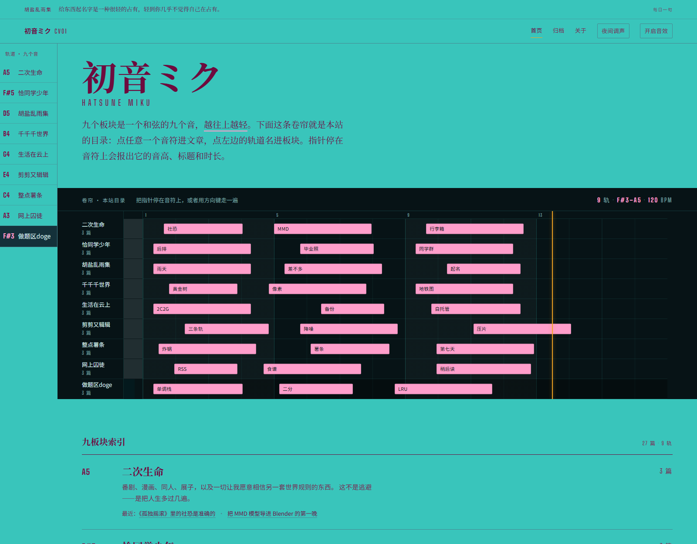

# 初音ミク CV01 · 个人博客骨架

一个用**钢琴卷帘当目录**的个人博客。主题是一条工程界面式的人声合成器：
九个板块 = 九条轨道 = 一个和弦的九个音。

站点只有一条线，就是 Nuxt 应用：

| 线路 | 是什么 | 怎么跑 |
|---|---|---|
| **Nuxt 应用** —— 唯一的线路 | Vue 3 + Vite 页面 + Nitro 服务端：首页 / 归档 / 板块 / 文章 / 关于 / 云村 / 写博客 / 门厅都是 Vue 组件，上传、鉴权、门厅与内容装配全在 `server/**` | `pnpm install` 之后 `pnpm dev`；要跑成品就 `pnpm build` 再 `node .output/server/index.mjs`（双击 `start.cmd` 就是这一条） |

内容来自 `content/posts.mjs`（外加界面写进 `data/*.json` 的那一半），
卷帘的位置算式都在 `content/roll.mjs`，颜色只写在 `content/palette.mjs`，
样式还是 `assets/css/` 里那几张——组件不重画 CSS，只把同一批 class 名交给 Vue 去吐。

> **1.x 那两条底线已经不在了，是决定不要的。** 零构建、双击 `index.html` 就能看、
> `file://` 照跑，这些原本属于「零构建静态页」那条线：2.0.0 把它留着，**这一次的整合把它删掉了**。
> 现在跑起来必须先 `pnpm install` 再 `pnpm build`，站点通过一台 Node 服务访问。
> 不受影响的只有一件事：**老地址还认得路**（见[操作手册里那张跳转表](HANDBOOK.md#老地址还认得路唯一留着的一件-1x-遗产)）。
> 仍然成立的底线是：**不碰网络**——Vue、marked、KaTeX 全部随站打包，字体与音频都在本地。

```
A5  二次生命        二次元
F#5 恰同学少年      同学回忆录
D5  胡盐乱雨集      随笔
B4  千千千世界      旅游
G4  生活在云上      在云村的音乐之旅
E4  剪剪又辑辑      剪辑
C4  整点薯条        美食
A3  网上囚徒        cyberWorld
F#3 做题区doge      EE学生的自我迭代
```

越往下越重，越往上越轻。音高名取代了 01/02/03 序号——**编号在这里携带信息**，不是装饰。
这九个音（F#3 – A5）堆叠三度，构成一个加了延伸音的和弦。懂乐理的人会心一笑，不懂的人只觉得这条上升的线好看。

<p align="center">
  
</p>

## 文档

这份 README 只讲**这是什么**和**为什么长这样**；另外两件事各有一份文件：

| 想看什么 | 去哪 |
|---|---|
| **怎么跑、怎么用、怎么发** —— 文件地图、上传系统、门厅、右键与编辑、Markdown 管线、云村、公网部署、提交前自检 | [**`HANDBOOK.md`** · 操作手册](HANDBOOK.md) |
| **设计是怎么来的** —— 概念、色彩、字体、版面、三轮换色的判断、配色生成器与窗、窄屏读法、已知取舍、设计资产 | [**`DESIGN.md`** · 设计志](DESIGN.md) |
| 视觉哲学宣言《校准之息》 | 本文件下一节 |
| 长期公网部署的完整流程（Cloudflare Tunnel + Access） | [`deploy/CLOUDFLARE-TUNNEL.md`](deploy/CLOUDFLARE-TUNNEL.md) |
| 版本线 | [`CHANGELOG.md`](CHANGELOG.md) |

跑起来三步：`pnpm install` → `pnpm build` → `node .output/server/index.mjs`
（Windows 上双击 `start.cmd` 就是最后一步，它会替你检查构建在不在）。
门槛与口令、编辑与上传、发布与自检，全在[操作手册](HANDBOOK.md)里。

## 设计哲学 · 校准之息（Calibrated Breath）

> 视觉哲学宣言，全文并入自 `design/DESIGN-PHILOSOPHY.md`。它不是版式规范，
> 而是一套观看世界的方式：把不可测量之物，当作可测量之物来郑重记录。

### 一 · 前提

这个运动相信：**记录本身是一种深情**。当某种东西短暂、易逝、无法称重，人类的回应不是抒情，而是架设仪器。于是格线出现了，刻度出现了，参考标记出现了——那不是冷，那是把转瞬即逝之物放进一个能被反复查看的坐标系里，让它获得第二次生命。

因此这个运动的画面是：一张极大、极静、偏冷的纸面之上，只开一扇暗窗。暗窗里是被观测的对象——密集、活跃、正在发生；纸面上是观测的结论——稀疏、精确、冷静。观看者先被那扇窗吸住，再被纸面上的寥寥数语留住。信息不写在段落里，信息住在结构中。

### 二 · 空间与形态

空间必须呼吸得像一间安静的实验室：大面积留白不是空，是**尚未被命名的时间**。所有元素都落在无形的格线上，没有任何东西漂移、没有任何东西"差不多对齐"。对齐是这个运动的道德。

形态语言由两种极端构成：一种是无限重复的细密标记——横线、竖线、短促的方块、连续的刻度，像耐心累积的观测数据；另一种是极少数的巨大几何姿态——一整条横贯画面的暗带，或一个抵住边界的方块。二者之间不留中间地带：没有既不大也不小的装饰性圆角盒子，没有为了填满而存在的形状。每一个形状都必须能回答"你在这里承担什么"。

### 三 · 颜色与材料

颜色在这个运动里是**职务**，不是气氛。全局只有四个职务：

**地**——一块有明确身份的色场：饱和、笃定、占画面七成以上。它不必假装是纸，也不必假装中立；它属于被观测的主体，而不是属于当下的潮流。一块有立场的底色，比一块安全的底色更难用好，也更值得用。

**墨**——这块色场能承受的最深一档，用于文字与结构线。它的色相应当与地面同族而不同调，读起来像同一种墨在干与未干之间的差别。它提供重量，但从不铺满，永远是线、是字、是极小的实心块。

**签**——一个亮度高于地面的强调色。它从不作为装饰出现，只作为**指认**出现：被选中的、被命名的、属于某一条轨道的东西才配拥有它。而它的稀缺不是被品味规定的，是被物理规定的——它一旦落到地面上就立刻失去可读性，因此它只被允许活在深色窗口的内部。一条被物理规律强制的纪律，比一条被风格偏好强制的纪律更可靠。

**示**——一点樱粉色，只承担一个含义："此刻"。它是游标、是正在发生的瞬间、是唯一允许移动的东西。整个画面里，它是唯一不属于地、墨、签三者的信号色；也因此，它只出现在能承受它的那几处——暗窗上的播放头，与地面上的焦点环。

材质上坚持平坦诚实：无渐变冒充光，无投影冒充深度，无玻璃冒充层次。唯一的"发光"来自强调色与樱粉在深色暗窗上的直接并置——那是色彩关系产生的光，不是滤镜产生的光。而当底色本身足够响亮时，画面里其余的等级差就必须交给**墨量**（粗细、疏密、不透明度）去表达，而不是继续加色相。这是这套色彩观里最容易被违反、也最值得守住的一条。

### 四 · 尺度与节奏

节奏来自**间距**，不来自花招。同一元素的耐心重复会生成一种类似呼吸的东西：密集处像急促的低语，疏朗处像停顿。愈是珍贵的元素，尺寸愈大、出现愈少；愈是背景性的元素，愈细密、愈统一、愈不引人注目。

尺度对比应当接近悬殊：巨大的字要大到近乎建筑，微小的标注要小到近乎仪器刻度上的刻痕。中间尺度是被禁止的——中间尺度是平庸的居所。字号、线宽、间距都要服从一条隐含的数列，让整幅画面看上去像同一个乐器发出的声音。

### 五 · 观看与呼吸

构图给出唯一的主导物：一扇暗的、横贯的水平窗。它是地平线。视线从它开始，向下进入安静的纸面区域，依次遇见成组的细线、极简的标注、以及唯一一句被允许存在的完整文字。第二视觉焦点可由一处偏置的纵向元素提供——一条游标、一根立柱、一段竖排的字——用方向上的对立制造张力，而不用颜色制造喧哗。

文字是**仪器的面板**，不是文章。它们以坐标标注的身份出现：短、准、成组、贴边、极少量。一句短语可以很大，但绝不能有一段解释。任何需要被"读"超过两秒的文字，都是失败的设计。

### 六 · 工艺

最终成品必须让人一眼看出：它被反复修改过。每一个像素级的间隙、每一处分隔的距离、每一组刻度终止的位置，都应当像是被某个人在无数个小时里反复推敲的结果——那种只有站在领域最顶端的人才有的、近乎固执的精确。没有任何元素可以越界，没有任何文字可以相碰，没有任何一处对齐是"差不多"。

克制的勇气在于删减：当你有冲动再加一条曲线、再加一个色块时，正确的动作是回到已有的形体，让它的间距更准、对比更纯、边缘更利落。**让它成为一件作品，而不是一份带装饰的文档。**

*最终画面应当呈现这样一个悖论：我们用最分析性的语言，去谈论最无法分析的东西——并且成功了。*

### 七 · 后记 —— 当地面不再饱和

这个运动先在一张海报上立论，然后被搬进一个真的要天天读的站点。搬迁途中地面换了：满屏饱和青退场，换上一块中性冷灰。于是上面第三节的每一条，都值得在这块新地面上重读一遍——重读之后它们一条也没有作废，只是各自换了住处。

**地**不再非得是彩色的。它的身份从色相挪进了灰度的阶梯：亮一档是纸，暗一档是窗，浮层再抬起半层。阅读的全部重量交给墨量的差——粗细、疏密、不透明度。第三节警告过这是"最容易被违反、也最值得守住"的一条；如今它不再是纪律，是承重墙本身。

**墨**必须中性。黑一旦染青，它就与青同族，青落在它上面只剩明度差、没有彩度差，画面里的四个颜色塌成三个。黑越纯，青越亮——这是算术，不是洁癖。

**签**是青。它没有被删除，它搬进了那扇窗。第三节说签"只被允许活在深色窗口的内部"，因为它一旦落到地面上就立刻失去可读性——这句话如今字面成立：青对中性地面只有 2:1，它在窗里做音符块有 8.8:1。当初被写下的是审美判断，执行它的是物理定律；一条纪律被现实亲自执法，是它所能得到的最高荣誉。

**示**仍是樱粉，仍只说"此刻"：播放头、焦点环、进度——画面上唯一会动的东西。它的深档同时接手了地面上的指认（链接、序号、音高名，4.5:1），于是签与示在地面上一度同族，靠一个动作分辨：**会动的是此刻，不动的是指认。**

海报因此在换色之后重做了一次：它不再以青底立论，而以"中性地面 + 一扇青窗"立论——同一句话的现在时。哲学一个字没改，改的是执行：每个颜色都待在它的对比度允许它待的地方，不多一个色相，不少一档墨。把不可测量之物放进坐标系，坐标系自己也在被测量。
